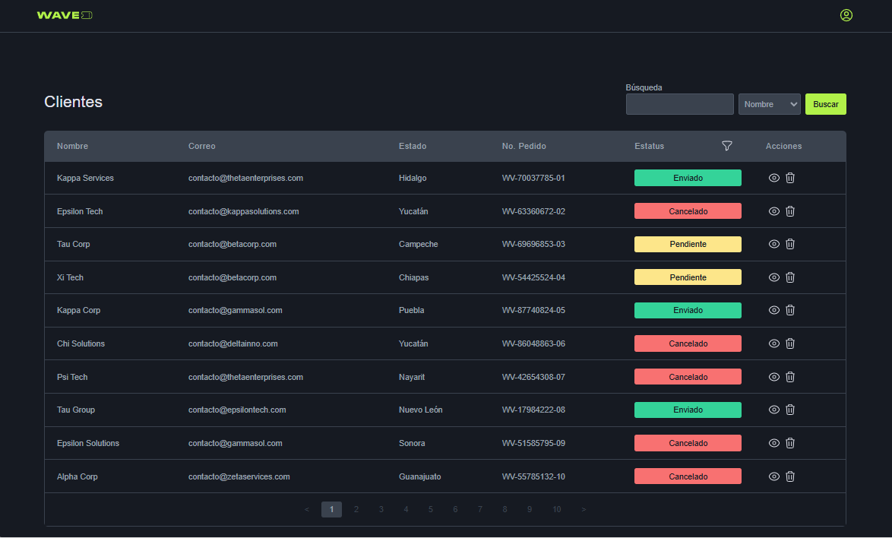

# 🌟 Client Dashboard - Acueducto

Welcome to the **Client Dashboard Challenge**! 🚀 This is a dynamic and interactive web application built with React, TypeScript, and Storybook. It showcases a client management dashboard that allows you to search, filter, and view client details with a modern, user-friendly interface.



## ✨ Features

- **Search and Filter**: Quickly search for clients and filter by status.
- **Interactive Table**: View and manage client data with ease.
- **Responsive Design**: Optimized for both desktop and mobile screens.
- **Modal Details**: View detailed information about each client in a modal.
- **Storybook Integration**: Explore and test UI components with Storybook.

## 🔧 Getting Started

To get started with this project, follow the steps below:

### 1. Clone the Repository

```bash
git clone https://github.com/yourusername/client-dashboard-challenge.git
cd client-dashboard-challenge
```

### 2. Install Dependencies

Make sure you have [Node.js](https://nodejs.org/) installed. Then, run:

```bash
npm install
```

### 3. Run the Application

Start the development server:

```bash
npm start
```
or

```bash
npm run start
```

Your app will be running at `http://localhost:3000`.

### 4. Run Storybook

To view and interact with the UI components in Storybook, run:

```bash
npm run storybook
```

Storybook will be available at `http://localhost:6006`.

### 5. Build for Production

To create a production build, run:

```bash
npm run build
```

## 📋 Scripts

- `npm start` - Runs the app in development mode.
- `npm run build` - Builds the app for production.
- `npm run test` - Runs the tests.
- `npm run storybook` - Starts Storybook for component development.
- `npm run build-storybook` - Builds Storybook for production.
- `npm run test:jest` - Runs Jest tests.
- `npm run test:watch` - Runs Jest tests in watch mode.
- `npm run test:coverage` - Runs Jest tests with coverage report.

## 🎨 Styles

This project uses [Tailwind CSS](https://tailwindcss.com/) for styling. Feel free to customize the Tailwind configuration to match your design needs.

## 🧪 Testing

Testing is set up with [Jest](https://jestjs.io/) and [Testing Library](https://testing-library.com/). Run `npm run test` to execute tests.

## 📜 License

This project is licensed under the MIT License. See the [LICENSE](./LICENSE) file for details.

---

Feel free to adjust the details and sections as necessary for your specific project needs. If you have any images or specific screenshots, don't forget to include them and adjust paths accordingly.